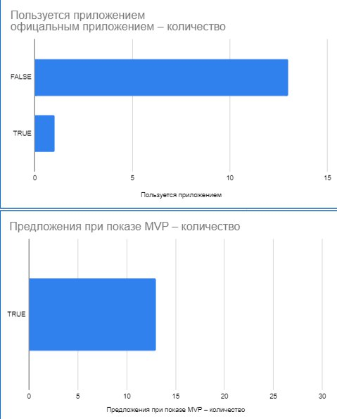

#  Pocket Portal

## Содержание проекта

### Участники проекта
- **Кочетов Николай Алексеевич** - teamleader
- **Филатов Максим Сергеевич** - main developer

### Цель

За многие годы существования ННГУ впервые создали мобильное приложение наши сокурсники, но их идея о полноценном переносе была не практична из-за:
- нагруженности приложения,
- плохой работе при слабом интернете,
- топорного интерфейса.

Их приложение не обрело большой популярности (как минимум среди наших знакомых со всего университета).

### Спрос

Мы провели опрос среди пользователей вышеуказанного приложения (их мало) и тех, кто вовсе не стал его пробовать, на тему того, как можно изменить идею, которая сможет угодить большему числу людей и будет использоваться как минимум у 15 человек на старте (включая другие институты).

### Задачи

- Возможность просмотра расписания без входа в аккаунт
- Сохранение последних данных расписания при плохом интернете
- Темная тема
- Полная конфиденциальность и отсутствие каких-либо баз данных, исключительно запросы к порталу
- Доработка интерфейса
- Уведомления
- Реализация идей с feedback’а

### Структура проекта и разработка

#### Технологии

Одним из важных аспектов разработки является поддержка основных платформ. На телефонах этими платформами являются Android и iOS. Удобным фреймворком для разработки для этих систем стал для нас **Flutter**.

#### Языки

При выборе Flutter нашим языком программирования для этого проекта автоматически стал **Dart**.

#### Стадия разработки

Текущая стадия разработки находится на подготовке к реализации зачетной книжки. Решение авторизации и получение данных от имени пользователя у нас уже есть. В production версии пока есть только расписание.

### Ссылки

- [Github проекта](https://github.com/MaximFLUNN/Pocket_Portal)
- [Figma](https://www.figma.com/design/NinvZSuV48IEnibOHjPMyT/UNN-PORTAL?m=dev&node-id=0-1&t=arSqbXNGmWY7s9SD-1)
- [Feedback portal](https://docs.google.com/spreadsheets/d/1UKWJz_NI4OomLiEEQX35ZIPW12QO8iN3ewQS0Zw-Its/edit?gid=0#gid=0)
- [Github - Кочетов Николай](https://github.com/esthete014)
- [Github - Филатов Максим](https://github.com/MaximFLUNN)

---

